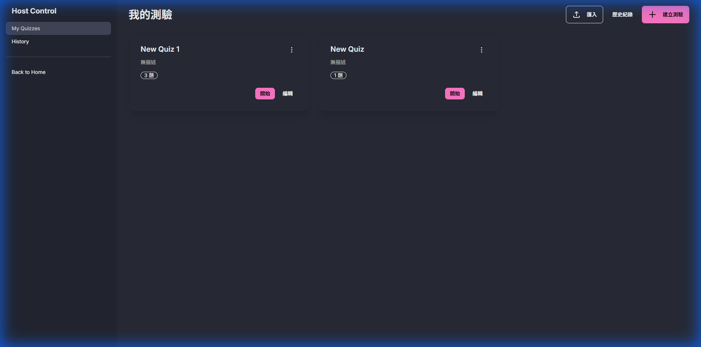
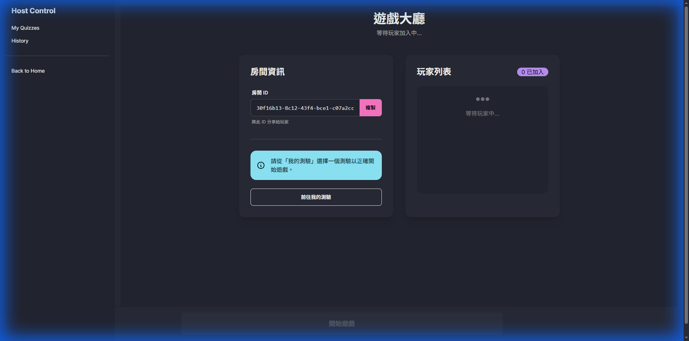
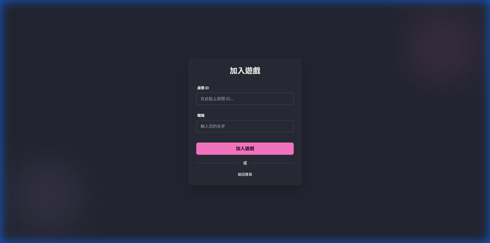

# Quiz Platform Monorepo (P2P)

這是一個基於 WebRTC (PeerJS) 的即時互動問答平台。採用 Serverless 架構，由 Host 端直接與 Player 端進行 P2P 連線，無需傳統後端伺服器即可進行多人即時遊戲。


## 🚀 技術棧 (Tech Stack)

*   **Frontend Framework**: [SvelteKit](https://kit.svelte.dev/) (Svelte 4)
*   **Styling**: [TailwindCSS](https://tailwindcss.com/) + [DaisyUI](https://daisyui.com/)
*   **Networking**: [PeerJS](https://peerjs.com/) (WebRTC Wrapper)
*   **State Management**: Svelte Stores
*   **Monorepo Tooling**: NPM Workspaces
*   **Testing**: [Vitest](https://vitest.dev/)
*   **CI/CD**: GitHub Actions

## 📂 專案結構 (Project Structure)

```bash
.
├── apps
│   └── web                     # 主應用程式 (SvelteKit)
│       ├── src
│       │   ├── lib
│       │   │   ├── components  # UI 元件 (e.g., QuestionEditor)
│       │   │   ├── stores      # 狀態管理 (gameStore, connectionStore)
│       │   │   ├── utils       # 工具函式 (quizUtils)
│       │   │   ├── connection.ts # PeerJS 連線邏輯
│       │   │   └── types.ts    # TypeScript 型別定義
│       │   └── routes
│       │       ├── host        # 主持人端頁面 (Lobby, Game, Quizzes)
│       │       ├── play        # 玩家端遊戲頁面
│       │       └── join        # 玩家加入頁面
│       └── vite.config.ts      # Vite & Vitest 設定
├── docs                        # 開發文件 (Architecture, Development Guide)
│   └── images                  # 文件截圖
├── legacy                      # 舊版程式碼 (參考用)
└── package.json                # Root config (Workspaces)
```

## 🛠️ 快速開始 (Getting Started)

### 前置需求
*   Node.js 20+
*   NPM 10+

### 安裝與執行

1.  **安裝依賴**
    ```bash
    npm install
    ```

2.  **啟動開發伺服器**
    ```bash
    npm run dev --workspace=apps/web
    ```
    應用程式將運行於 `http://localhost:5173`。

3.  **執行測試**
    ```bash
    # 執行所有單元測試
    npm run test --workspace=apps/web
    
    # 產生測試覆蓋率報告
    npm run coverage --workspace=apps/web
    ```

## 🌟 核心功能 (Key Features)

*   **P2P 架構**: 無需後端，Host 建立房間後生成 Room ID，Players 直接連線。
*   **即時互動**: 支援即時搶答、同步倒數計時、即時分數更新。
*   **多樣題型**:
    *   單選題 (Single Choice)
    *   複選題 (Multiple Choice)
    *   簡答題 (Short Answer) - 支援手動評分
*   **完整編輯器**: 支援題目排序、圖片預覽、草稿儲存與防呆機制。
    
*   **斷線重連**: 支援自動重連與 Session 恢復，確保遊戲體驗流暢。

## 🎮 遊戲流程 (Game Flow)

本專案靈感源自 **Kahoot!** 與 **Quizizz** 等互動問答平台，旨在提供輕量化、無需後端的替代方案。

1.  **大廳階段 (Lobby)**
    *   **Host**: 選擇測驗並建立房間，顯示 Room ID。
        
    *   **Player**: 輸入 ID 加入房間，輸入暱稱。
        
    *   **Host**: 等待所有玩家加入後，點擊「開始遊戲」。

2.  **答題階段 (Question)**
    *   **Host**: 廣播題目與選項，啟動倒數計時器。
    *   **Player**: 手機端顯示選項按鈕 (或文字輸入框)，進行作答。
    *   **System**: 倒數結束或所有玩家作答完畢後，自動進入下一階段。

3.  **審閱階段 (Review) - *僅簡答題***
    *   **Host**: 若為簡答題，主持人需手動審閱玩家答案並評分 (Correct/Incorrect)。
    *   **Player**: 等待主持人評分。

4.  **結果階段 (Result)**
    *   **Host**: 公布正確答案與該題統計數據。
    *   **Player**: 顯示個人答題結果 (正確/錯誤) 與目前積分/連勝。

5.  **結算階段 (Leaderboard)**
    *   所有題目結束後，顯示最終排行榜 (前三名)。
    *   遊戲紀錄自動封存至 Host 端的歷史紀錄中。

## 📝 開發規範 (Development Guidelines)

詳細開發規範請參閱 [docs/development.md](docs/development.md)。

*   **Branching**: `feature/*`, `chore/*`, `fix/*`
*   **Commit Style**: Conventional Commits
*   **Linting**: Prettier + ESLint (Husky pre-commit hook enabled)

## ⚠️ 已知問題 (Known Issues)

由於專案鎖定於 **Svelte 4**，部分相依套件 (如 `vite-plugin-svelte`) 無法升級至支援 Vite 6 的最新版。目前採用鎖定版本策略以維持穩定性。詳情請見開發文件。
